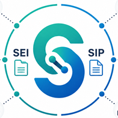

# @anpdgovbr/sei-sip-soap



Infraestrutura SOAP compartilhada pelos clientes `@anpdgovbr/sei-client` e
`@anpdgovbr/sip-client`.

Este pacote é publicado para resolver a dependência de runtime dos clientes. A
API é técnica e voltada a transporte SOAP, montagem de envelopes, parsing de
respostas e erros comuns. Consumidores finais normalmente devem usar os clientes
de domínio em vez de chamar este pacote diretamente.

## Uso

```ts
import { SoapError, callSoap } from "@anpdgovbr/sei-sip-soap"
```

## Compatibilidade

- Node.js 22 ou superior.
- ESM e CommonJS via `exports`.
